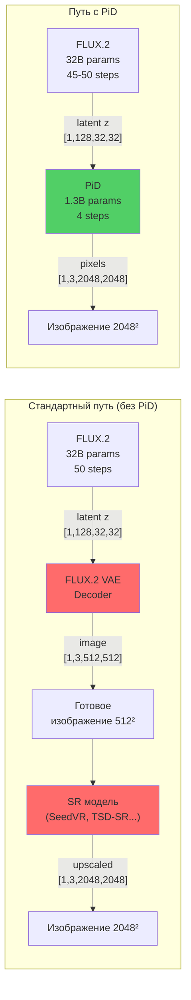
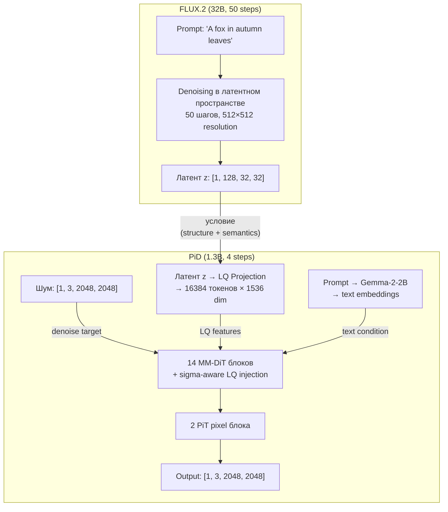

# PiD + FLUX.2: Пошаговый разбор всего пайплайна

## Общая картина

Да, суть именно в этом: **FLUX.2 работает как обычно**, генерирует латент в своём латентном пространстве, а потом PiD берёт этот латент и декодирует его напрямую в пиксели **с апскейлом 4×** — минуя стандартный VAE декодер.



> [!IMPORTANT]
> PiD **НЕ работает в латентном пространстве**. Он работает в **пиксельном**. Это пиксельная диффузия (denoising в пространстве `[B, 3, 2048, 2048]`), которая обусловлена на латент FLUX.2.

---

## Шаг за шагом — что происходит в коде

### Шаг 1: FLUX.2 генерирует латент

Из [_demo_common.py:445-462](file:///home/dimweb/auto_remaster/auto_remaster/sandbox/PiD/pid/_src/inference/_demo_common.py#L445-L462):

```python
# Запускаем FLUX.2 pipeline из diffusers
gen_kwargs = dict(
    prompt=prompt,
    height=512, width=512,          # генерируем в 512×512
    num_inference_steps=50,          # FLUX.2 default: 50 шагов
    guidance_scale=4.0,
    output_type="latent",            # ← КЛЮЧЕВОЙ МОМЕНТ: получаем латент, НЕ картинку!
    generator=generator,
    max_sequence_length=512,
)

raw_output = pipeline(**gen_kwargs)
# raw_output.images → [1, seq_len, C] в packed формате FLUX.2
```

FLUX.2 отработала 50 шагов denoising в **своём** латентном пространстве (32B трансформер) и вернула финальный латент. На этом этапе FLUX.2 полностью закончила свою работу.

### Шаг 2: Распаковка латента

FLUX.2 возвращает латент в packed формате `(B, seq_len, C)`. Нужно привести к обычному `(B, C, H, W)`:

Из [pipeline_registry.py:284-299](file:///home/dimweb/auto_remaster/auto_remaster/sandbox/PiD/pid/_src/inference/pipeline_registry.py#L284-L299):

```python
# FLUX.2: packed (B, seq_len, C) → (B, C, H, W)
# Используем position IDs для правильной распаковки
latent_h = 512 // (8 * 2)  # = 32    (8× encoder + 2× patchify)
latent_w = 512 // (8 * 2)  # = 32
# → latent shape: [1, 128, 32, 32]
```

| Что                        | Размер            |
|----|---|
| Входное изображение         | 512 × 512         |
| После encoder (8× compression) | 64 × 64       |
| После patchify 2×2          | 32 × 32           |
| Каналы (32 z_ch × 2×2 patch)| **128**           |
| **Итоговый латент**         | **[1, 128, 32, 32]** |

### Шаг 3: VAE decode для baseline (опционально)

PiD код делает VAE decode для сравнения, но это **не обязательная** часть пайплайна:

```python
# Стандартный FLUX.2 VAE decode для baseline:
# 1. BatchNorm denormalize: z * bn_std + bn_mean
# 2. Unpatchify: (B,128,32,32) → (B,32,64,64)
# 3. Decoder: (B,32,64,64) → (B,3,512,512)
vae_img_01 = decode_with_pipeline_vae(pipeline, latent, pipe_cfg)
# → [1, 3, 512, 512] в [0, 1]
```

> [!NOTE]
> В продакшене можно **вообще не делать VAE decode** — PiD может работать только от латента. VAE decode тут нужен только для сравнения результатов.

### Шаг 4: Подготовка входов для PiD

Из [_demo_common.py:557-562](file:///home/dimweb/auto_remaster/auto_remaster/sandbox/PiD/pid/_src/inference/_demo_common.py#L557-L562):

```python
data_batch = {
    "caption":          [prompt],                    # текстовый промпт (тот же что и для FLUX.2)
    "LQ_video_or_image": vae_decoded_image,          # [1, 3, 512, 512] в [-1, 1] — VAE decode
    "LQ_latent":         latent,                     # [1, 128, 32, 32] — сырой латент FLUX.2
    "degrade_sigma":     torch.tensor([sigma]),       # уровень шума в латенте (≈0 для x0)
}

infer_image_size = (512 * 4, 512 * 4)  # = (2048, 2048) — целевое разрешение
```

PiD получает **три сигнала**:
1. **Текст** — тот же промпт, кодируется через Gemma-2-2B
2. **Латент** — сырой выход FLUX.2 `[1, 128, 32, 32]`
3. **Sigma** — уровень шума (0 для полностью денойзенного x0, >0 для early exit)

> [!TIP]
> `LQ_video_or_image` (VAE decoded image) на практике **не используется** для FLUX.2 конфигурации. В конфиге `lq_condition_type="latent"`, поэтому PiD работает только с латентом. Image branch (`lq_in_channels=3`) существует в коде, но для VAE-based моделей PiD использует только latent branch.

### Шаг 5: Внутри PiD — подготовка шума

Из [pid_distill_model.py:248](file:///home/dimweb/auto_remaster/auto_remaster/sandbox/PiD/pid/_src/models/pid_distill_model.py#L248):

```python
# Генерируем чистый гауссов шум в ПИКСЕЛЬНОМ пространстве 2048×2048
noise = torch.randn(1, 3, 2048, 2048, device="cuda")
```

Это **начальный шум для пиксельной диффузии**. PiD будет денойзить этот шум в чистые пиксели.

### Шаг 6: 4-step sampling loop

Из [pid_distill_model.py:112-161](file:///home/dimweb/auto_remaster/auto_remaster/sandbox/PiD/pid/_src/models/pid_distill_model.py#L112-L161):

```python
t_list = [0.999, 0.866, 0.634, 0.342, 0.0]  # 4 шага + финальный 0

x = noise  # [1, 3, 2048, 2048] — чистый шум

for t_cur, t_next in zip(t_list[:-1], t_list[1:]):
    # t_cur: 0.999 → 0.866 → 0.634 → 0.342
    # t_next: 0.866 → 0.634 → 0.342 → 0.0
    
    # Forward pass через PiD сеть (1.3B PixelDiT + LQ adapter)
    v_pred = net(
        x,                              # текущий зашумлённый образ [1,3,2048,2048]
        t_cur * 1000,                   # timestep (scaled by timescale=1000)
        caption_embs,                   # текстовые эмбеддинги от Gemma-2-2B
        lq_latent=latent,               # [1,128,32,32] — условие от FLUX.2
        degrade_sigma=sigma_tensor,     # уровень шума в латенте
    )
    
    if t_next > 0:
        # SDE sampling: predict x0, add noise at t_next level
        x0_pred = velocity_to_x0(x, v_pred, t_cur)
        eps_new = torch.randn_like(x0_pred)
        x = (1 - t_next) * x0_pred + t_next * eps_new
    else:
        # Последний шаг: чистый x0
        x = velocity_to_x0(x, v_pred, t_cur)
```

Вот что происходит на каждом шаге:

```
Шаг 1: t=0.999 → 0.866  |  x = почти чистый шум   → немного проясняется
Шаг 2: t=0.866 → 0.634  |  x = мутное изображение → появляется структура
Шаг 3: t=0.634 → 0.342  |  x = грубая картинка    → детали проявляются
Шаг 4: t=0.342 → 0.000  |  x = детализированная   → финальные пиксели 2048²
```

### Шаг 7: Что происходит внутри каждого forward pass сети

На каждом из 4 шагов PiD делает полный forward через [pid_net.py](file:///home/dimweb/auto_remaster/auto_remaster/sandbox/PiD/pid/_src/networks/pid_net.py#L265-L469):

```
1. Пиксельное изображение x [1, 3, 2048, 2048]
   ↓
2. Unfold в patch tokens: [1, 16384, 768]  (128×128 патчей по 16×16)
   ↓
3. s_embedder → patch token embeddings [1, 16384, 1536]
   ↓
4. ПАРАЛЛЕЛЬНО: LQ Projection обрабатывает латент FLUX.2:
   latent [1, 128, 32, 32]
     → nearest upsample → [1, 128, 128, 128]     (выровняли с patch grid)
     → Conv(128→512) + SiLU + Conv(512→512)
     → 4× ResBlock(512)
     → flatten → [1, 16384, 512]                  (те же 16384 токена!)
     → 7 output heads: Linear(512→1536) each       (для 14 блоков, через 1)
   ↓
5. 14 MM-DiT блоков (image + text joint attention):
   Каждые 2 блока — inject LQ features:
     h = h + sigmoid(Linear([h, lq]) - 5·σ) * lq    ← sigma-aware gate
   ↓
6. PiT pixel blocks (2 блока) — fine pixel prediction
   ↓
7. Fold back → output [1, 3, 2048, 2048]            ← velocity prediction v(x_t, t)
```

### Шаг 8: Финальный результат

```python
# x0_student: [1, 3, 2048, 2048] в [-1, 1]
return x0_student.clamp(-1, 1)
# → сохраняем как JPG/PNG
```

---

## Визуализация: что видит PiD на каждом уровне



---

## Early Termination — зачем и как

### Идея

FLUX.2 делает 50 шагов. Первые ~40 шагов определяют **структуру** (layout, composition, основные формы). Последние 5-10 шагов добавляют **мелкие детали** (текстуры, hair strands, мелкий текст).

PiD может взять латент **до** завершения всех шагов:

```python
# Вместо 50 шагов, останавливаем на 45-м
# callback_on_step_end сохраняет x_t на шаге 46
xt_callback = XtCaptureCallback({46})

raw_output = pipeline(
    ..., 
    num_inference_steps=50,
    callback_on_step_end=xt_callback,     # перехватываем x_t
    callback_on_step_end_tensor_inputs=["latents"],
)

# xt_callback.captured[46] = (latent_at_step_46, sigma_at_step_46)
# sigma ≈ 0.08 — есть немного остаточного шума
```

### Что это даёт

| Вариант | LDM шагов | PiD sigma | Результат |
|---|---|---|---|
| PiD(50/50) | 50 (полный) | σ ≈ 0 | PiD верен структуре FLUX.2, мало "фантазирует" |
| **PiD(46/50)** | 46 | σ ≈ 0.08 | **Оптимум**: PiD "додумывает" fine details |
| PiD(40/50) | 40 | σ ≈ 0.2 | PiD больше генерирует, но может отклоняться |
| PiD(30/50) | 30 | σ ≈ 0.4 | Слишком рано — структура не сформирована |

Sigma-aware gate автоматически регулирует, насколько PiD доверяет латенту:
- σ ≈ 0: gate ≈ 0.88 — PiD следует латенту
- σ ≈ 0.08: gate ≈ 0.83 — чуть больше свободы
- σ ≈ 0.4: gate ≈ 0.50 — половина от латента, половина генерация

---

## Почему это работает лучше, чем VAE + SR

### Проблема каскада: VAE → SR модель

```
FLUX.2 latent → VAE Decode [1,3,512,512] → SR Model [1,3,2048,2048]
```

1. **VAE теряет детали**: VAE обучен реконструировать, а не генерировать. Артефакты латента (мелкий шум, квантизация) **пролезают** через декодер.
2. **SR модель видит только пиксели**: Она не знает, что "хотела" генеративная модель. Она получает 512² картинку и делает "умный upscale", но не может _восстановить_ информацию, которую VAE уже потерял.
3. **Двойная ошибка**: Ошибки VAE decode **амплифицируются** SR моделью.

### Преимущество PiD

```
FLUX.2 latent → PiD [1,3,2048,2048]
```

1. **PiD видит сырой латент**: Вся семантическая информация из FLUX.2 доступна напрямую — нет потерь от VAE decode.
2. **Pixel diffusion prior**: PiD обучен генерировать high-res пиксели с нуля (pretrained PixelDiT). Он может **синтезировать** детали, а не просто "увеличить" существующие.
3. **Text conditioning**: PiD знает промпт — если в промпте "мелкий текст на вывеске", PiD может _нарисовать_ этот текст, а не пытаться апскейлить размытые буквы.

---

## Latency сравнение

| Pipeline | Время (GB200) |
|---|---|
| FLUX.2 512² → VAE decode → SeedVR2 SR | 6.6 + 0.06 + 1.2 = **~7.9 сек** |
| FLUX.2 512² → VAE decode → TSD-SR | 6.6 + 0.06 + 0.7 = **~7.4 сек** |
| FLUX.2 512² → **PiD** | 6.6 + **0.21** = **~6.8 сек** |
| FLUX.2 native 2048² | **102.2 сек** (квадратично по resolution) |

PiD быстрее SR моделей **И** даёт лучшее качество. А нативная FLUX.2 в 2048² в 14× медленнее.
