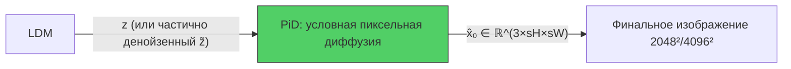
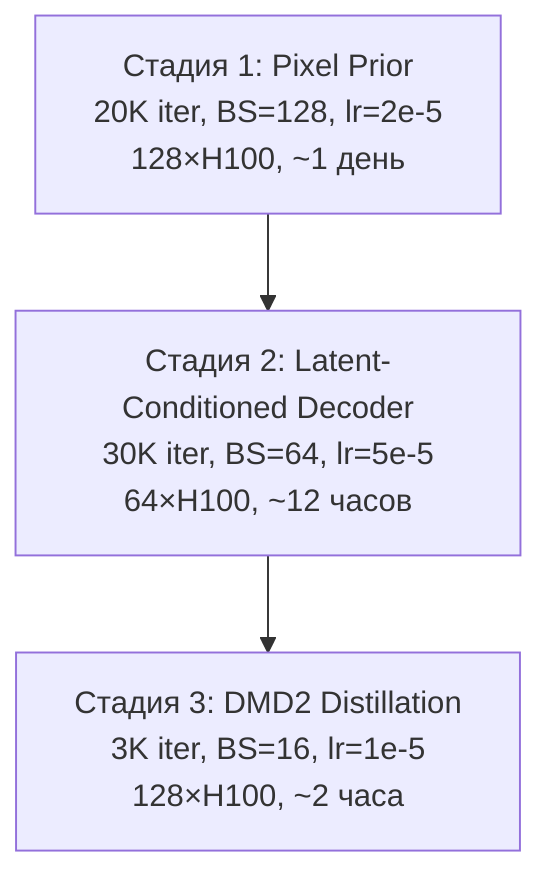
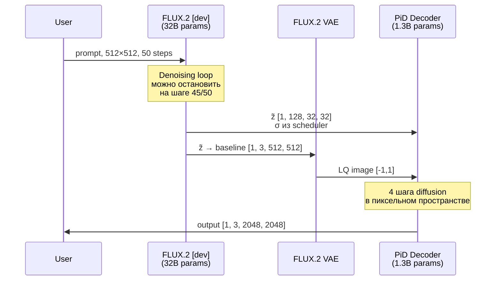

# PiD — Pixel Diffusion Decoder: Подробный разбор

> **Авторы**: Yifan Lu, Qi Wu, Jay Zhangjie Wu, Zian Wang, Huan Ling, Sanja Fidler, Xuanchi Ren (NVIDIA)
> **arXiv**: 2605.23902 (Май 2026)
> **Код**: [pid/_src/](file:///home/dimweb/auto_remaster/auto_remaster/sandbox/PiD/pid/_src/)

---

## 1. Что такое PiD — в одном абзаце

PiD — это **пиксельный диффузионный декодер**, который заменяет стандартный VAE/RAE декодер в латентных диффузионных моделях. Вместо того чтобы декодировать латент в пиксели через reconstruction-ориентированный декодер (и потом отдельно делать super-resolution), PiD **объединяет декодирование и апсемплинг** в единый генеративный процесс: условная пиксельная диффузия, обусловленная на латент. Результат — изображение в 4× или 8× большем разрешении, за **4 шага** (после дистилляции DMD2), с **~210 мс** на GB200.

---

## 2. Мотивация и проблема

### Что не так с VAE декодером?


1. **Реконструкция ≠ генерация**: VAE декодер обучен _инвертировать_ энкодер, а не _синтезировать_ детали. Он пропускает или усиливает артефакты, не может "додумать" текстуры.
2. **Каскадность**: Нужно сначала декодировать (VAE), потом апсемплировать (SR модель), а если SR диффузионный — ещё раз закодировать+декодировать в латентном пространстве.
3. **Масштаб**: VAE декодер исчерпывает память (~80 ГБ GPU) уже на ~2500² пикселей без тайлинга.
4. **RAE проблема**: Representation Autoencoders (DINOv2, SigLIP) сохраняют семантику, но _теряют_ low-level appearance → стандартный декодер не может это восстановить.

### Решение PiD



Одна модель. Одна стадия. Декодирование + апсемплинг.

---

## 3. Архитектура

### 3.1 Backbone: PixelDiT (1.3B параметров)

PiD построен поверх **PixelDiT** — пиксельного DiT в стиле MMDiT:

| Параметр | Значение |
|----------|----------|
| Patch size | 16×16 |
| Hidden size | 1536 |
| Attention heads | 24 |
| MM-DiT blocks (image+text) | 14 |
| PiT pixel blocks | 2 |
| Pixel token dim | 16 |
| Text encoder | Gemma-2-2B-it (frozen, 2304-dim) |
| Max text length | 300 токенов |
| RoPE | NTK-aware, ref 1024×1024 |

Работает в **пиксельном пространстве** (не в латентном!). Патчит входное изображение на 16×16 кусочки → трансформер → pixel pathway → fold обратно.

### 3.2 LQ Projection + Injection (ControlNet-style адаптер)

Ключевой вклад — **как инжектировать латентное условие** в пиксельный backbone.

#### Схема обработки латента

```
Latent z̃_σ [B, C_z, h_z, w_z]
    ↓
Nearest Resize → [B, C_z, pH, pW]  (align к patch grid)
    ↓
Conv2d(C_z → 512, 3×3) → SiLU → Conv2d(512 → 512, 3×3)
    ↓
4× ResBlock(512, GroupNorm_4)
    ↓
Flatten → [B, N, 512]  (N = pH × pW = 16384 для 2048²)
    ↓
Per-block Linear(512 → 1536) × 7 output heads (zero-initialized!)
```

Код: [lq_projection_2d.py](file:///home/dimweb/auto_remaster/auto_remaster/sandbox/PiD/pid/_src/networks/lq_projection_2d.py)

#### Инъекция каждые 2 блока (interval=2)

В [pid_net.py](file:///home/dimweb/auto_remaster/auto_remaster/sandbox/PiD/pid/_src/networks/pid_net.py#L215-L219):

```python
for i in range(self.patch_depth):  # 14 блоков
    if has_lq and self.lq_proj.is_gate_active(i):  # каждые 2 блока
        out_idx = self.lq_proj._get_output_index(i)
        s_main = self.lq_proj.gate(s_main, lq_features[out_idx], sigma=degrade_sigma, ...)
    
    s_main, y_emb = self.patch_blocks[i](s_main, y_emb, ...)
```

14 блоков / interval 2 = **7 точек инъекции** → 7 output heads.

### 3.3 Sigma-Aware Gate — ключевая формула

Формула из [lq_projection_2d.py:48-53](file:///home/dimweb/auto_remaster/auto_remaster/sandbox/PiD/pid/_src/networks/lq_projection_2d.py#L48-L53):

$$h_i \leftarrow h_i + g_i(h_i, l_i, \sigma) \odot l_i$$

где gate:

$$g_i(h_i, l_i, \sigma) = \text{sigmoid}\left(\text{Linear}([h_i, l_i]) - e^{\log\alpha} \cdot \sigma\right)$$

| Инициализация | Значение | Эффект |
|---|---|---|
| `content_proj.bias` | **2.0** | Без σ → gate ≈ sigmoid(2.0) ≈ 0.88 — сильно доверяем латенту |
| `log_alpha` | **log(5)** | α=5, σ-зависимый bias |
| При σ=0 | sigmoid(2.0) ≈ **0.88** | Чистый латент → доверяем сильно |
| При σ=0.4 | sigmoid(2.0 - 5·0.4) ≈ **0.50** | Наполовину шумный → средне |
| При σ=1.0 | sigmoid(2.0 - 5·1.0) ≈ **0.05** | Полный шум → почти игнорируем |

> [!IMPORTANT]
> Это **per-token, per-channel** gate (не скаляр на всё изображение!). Каждый пространственный токен и канал получает своё значение gate через `Linear(2*D → D)`. σ-часть broadcast'ится `(B,1,1) → (B,N,D)`.

### 3.4 Zero-Init Strategy

Все output heads в LQ projection **инициализированы нулями**:
```python
nn.init.zeros_(head.weight)
nn.init.zeros_(head.bias)
```

Это означает: **в начале обучения PiD = исходный PixelDiT text-to-image**. Латентное условие постепенно "включается" по мере обучения.

---

## 4. Процесс обучения

### 4.1 Три стадии



#### Стадия 1 — Pixel Diffusion Prior

Файнтюн PixelDiT 1.3B с 1K до 2K разрешения. Обычный rectified flow:

$$x_t = t \cdot x_0 + (1-t) \cdot \epsilon, \quad \epsilon \sim \mathcal{N}(0, I)$$

$$\mathcal{L}_{\text{FM}} = \|v_\theta(x_t, t, c) - (x_0 - \epsilon)\|_2^2$$

Shift = 6 (вместо 4 для 1K), NTK-aware RoPE для экстраполяции позиций.

#### Стадия 2 — Latent-Conditioned Decoder

Добавляется LQ Projection адаптер. Совместный файнтюн backbone + адаптера. **Noisy latent conditioning**:

$$\tilde{z}_\sigma = (1-\sigma) \cdot z + \sigma \cdot \xi, \quad \xi \sim \mathcal{N}(0,I), \quad \sigma \sim \mathcal{U}(0, 0.8)$$

- **σ_max = 0.8** — тренируем на латентах с шумом до 80% от полного
- 10% caption dropout + 10% latent-condition dropout (для CFG)

> [!TIP]
> Noisy conditioning имеет **двойную цель**:
> 1. **Регуляризация**: не даёт декодеру слепо копировать латент (заставляет генерировать детали)
> 2. **Early exit**: позволяет принимать частично денойзенные латенты с LDM

#### Стадия 3 — DMD2 Distillation (4 шага)

Sigma schedule для student: `[0.999, 0.866, 0.634, 0.342]`

| Компонент | Вес |
|---|---|
| DMD loss | 1.0 |
| Denoising score matching | 1.0 |
| GAN (projected) | 0.05 |
| R1 regularization | 200.0 |

Дискриминатор — DiT с 26 блоками и hidden_dim=1536. CFG дистиллируется в student (не нужен при инференсе).

### 4.2 Данные

- **2.6M** отфильтрованных high-res изображений (MultiAspect-4K-1M + PDF рендеры + internal)
- Фильтрация по Q-Align (quality score)
- Multi-aspect ratio buckets: 16:9, 4:3, 1:1, 3:4, 9:16
- 3 уровня caption'ов per image (short <50, medium 50-200, long 200-300 слов) через Qwen3-VL-8B

---

## 5. Как PiD работает с FLUX.2

### 5.1 Что особенного в FLUX.2 VAE

FLUX.2 VAE **отличается** от FLUX.1 VAE:

| Параметр | FLUX.1 | FLUX.2 |
|---|---|---|
| z_channels | 16 | **32** |
| Effective channels | 16 | **128** (32 × 2×2 patchify) |
| Spatial compression | 8× | **16×** (8× encoder + 2× patchify) |
| Normalization | scale_factor / shift_factor | **BatchNorm2d** (running stats) |
| Decoder normalization | simple scaling | **inv_normalize** (BN inverse) |

Код VAE: [flux2_vae.py](file:///home/dimweb/auto_remaster/auto_remaster/sandbox/PiD/pid/_src/tokenizers/flux2_vae.py)

Пайплайн encode:
```
image [B, 3, H, W]
    → Encoder → moments [B, 64, H/8, W/8]
    → take mean [B, 32, H/8, W/8]  
    → Patchify 2×2 → [B, 128, H/16, W/16]
    → BatchNorm2d normalize → latent z
```

### 5.2 Специфика конфигурации PiD для FLUX.2

Из [flux2.py](file:///home/dimweb/auto_remaster/auto_remaster/sandbox/PiD/pid/_src/configs/pid/experiment/flux2.py#L9-L18):

```python
cfg = _common_model_overrides(state_ch=128)  # 128 каналов!
cfg["net"] = {
    **cfg["net"],
    "lq_latent_channels": 128,       # FLUX.2 VAE output channels
    "latent_spatial_down_factor": 16, # 16× spatial compression
}
```

Это влияет на LQ Projection:

```python
z_to_patch_ratio = (sr_scale * latent_spatial_down_factor) / patch_size
                 = (4 * 16) / 16 = 4
```

Поскольку `z_to_patch_ratio > 1` (латент имеет _меньше_ пространственное разрешение, чем patch grid):
```python
# Latent lower res than patch grid → nearest upsample
z_aligned = F.interpolate(lq_latent, size=(pH, pW), mode="nearest")
```

Для 2048² output:
- Patch grid: 2048/16 = **128×128** = 16384 токенов
- FLUX.2 latent (от 512² input): 512/16 = **32×32**
- → Nearest upsample 32→128 (4× в каждом измерении)

### 5.3 Инференс Pipeline с FLUX.2



Из [_demo_common.py:556-574](file:///home/dimweb/auto_remaster/auto_remaster/sandbox/PiD/pid/_src/inference/_demo_common.py#L556-L574):

```python
data_batch = {
    "LQ_video_or_image": baseline_neg1_1,     # VAE decoded image [B,3,512,512]
    "LQ_latent": latent,                       # raw latent [B,128,32,32]
    "degrade_sigma": torch.tensor([sigma]),     # noise level из LDM scheduler
}
samples = model.generate_samples_from_batch(
    data_batch,
    cfg_scale=1.0,       # CFG дистиллирован в student
    num_steps=4,          # 4-step distilled
    image_size=(2048, 2048),
)
```

### 5.4 Early LDM Termination с FLUX.2

FLUX.2 по умолчанию использует 50 шагов. PiD рекомендует останавливать на шаге **45-48/50** (сохранять `xt` при `save_xt_steps=46`):

| Backbone | Всего шагов | Рекомендуемый exit | Экономия |
|---|---|---|---|
| FLUX.1 | 28 | шаг 24 | ~14% шагов LDM |
| FLUX.2 | 50 | шаг 46 | ~8% шагов LDM |
| SD3 | 28 | шаг 24 | ~14% |
| Z-Image | 50 | шаг 46 | ~8% |

При early termination PiD получает **частично шумный латент** и "додумывает" детали — часто получается **качественнее**, чем от полностью денойзенного латента, потому что PiD может свободнее генерировать fine-grained текстуры.

### 5.5 Результаты для FLUX.2

Из таблицы результатов для **FLUX.2 VAE (FLUX.2[dev])**:

| Метод | MUSIQ↑ | NIQE↓ | DEQA↑ | Uni-IAA↑ | Uni-IQA↑ | VQ-R1↑ | Latency (compile) |
|---|---|---|---|---|---|---|---|
| VAE + Real-ESRGAN | 72.19 | 4.44 | 4.19 | 61.96 | 74.77 | 4.58 | 62 ms |
| VAE + SeedVR2-3B | 73.41 | 3.55 | 4.18 | 62.85 | 74.72 | 4.58 | 1237 ms |
| VAE + TSD-SR | 74.07 | 3.59 | 4.21 | 61.72 | 75.28 | 4.62 | 725 ms |
| VAE + InvSR-1 | **74.13** | 3.65 | 4.25 | 63.52 | 75.47 | 4.60 | 1018 ms |
| **PiD (45/50)** | 73.79 | **3.12** | **4.30** | **66.01** | **75.71** | **4.66** | **206 ms** |

> [!IMPORTANT]
> **PiD vs native FLUX.2 at 2048²**: FLUX.2 нативная генерация 2K занимает **102.2 сек** (32B модель, 50 шагов). PiD: FLUX.2 512² (6.6с) + PiD decode (0.5с) = **7.1 сек** — это **14.3× быстрее** при сопоставимом качестве.

### 5.6 Особенности SSDD baseline для FLUX.2

Интересно, что для FLUX.2 **SSDD (Single-Step Diffusion Decoder) деградирует сильнее**, чем для FLUX.1/SD3 — метрики Uni-IAA/IQA проседают до 42-55 (vs 66 у PiD). Авторы объясняют это тем, что BatchNorm-based нормализация FLUX.2 VAE хуже совместима с SSDD.

---

## 6. Ключевые технические детали

### 6.1 Rectified Flow Convention

PiD использует специфическое направление flow:

$$x_t = t \cdot x_0 + (1-t) \cdot \epsilon$$

При $t=1$: чистое изображение. При $t=0$: чистый шум. Velocity target:

$$v_\theta \approx x_0 - \epsilon$$

Shift = 6 (logit-normal timestep sampling, mean=0, std=1).

### 6.2 Student Sigma Schedule

```python
student_t_list = [0.999, 0.866, 0.634, 0.342, 0.0]
```

4 шага: 0.999 → 0.866 → 0.634 → 0.342 → 0.0

### 6.3 Context Parallelism

Для больших разрешений (4K) используется **context parallelism** — токены изображения разбиваются по CP-рангам (seq_dim). LQ features реплицируются, а потом split'ятся. Поддержка в [pid_net.py](file:///home/dimweb/auto_remaster/auto_remaster/sandbox/PiD/pid/_src/networks/pid_net.py#L184-L186):

```python
if self._cp_group is not None:
    lq_features = [split_inputs_cp(f, seq_dim=1, cp_group=self._cp_group) for f in lq_features]
```

### 6.4 Latency и Memory

| Output Resolution | PiD Eager (ms) | PiD Compile (ms) | PiD Memory | VAE Eager (ms) |
|---|---|---|---|---|
| 2048² | ~510 | ~210 | 13 GB | 18 ms |
| 3072² | ~1100 | ~470 | 20 GB | OOM |
| 4096² | ~1900 | ~830 | 28 GB | OOM |

VAE = OOM на >2500² при 80 GB GPU без тайлинга!

---

## 7. Связь с твоей работой

### 7.1 Общее с текущим подходом

Твоя работа (residual flow distillation для FLUX.2-Klein) и PiD решают **смежные задачи**:

| Аспект | Твой подход | PiD |
|---|---|---|
| Цель | Дистилляция 32B → ~600M | Замена VAE декодера + SR |
| Домен | Латентное пространство | Пиксельное пространство |
| Модель | UNet ~600M | PixelDiT 1.3B |
| Flow | Rectified flow matching | Rectified flow matching |
| Дистилляция | Прямой flow matching на residual | DMD2 (distribution matching) |
| Условие | Noisy source latent (σ=0.3) | Noisy latent conditioning (σ_max=0.8) |

### 7.2 Ключевые идеи из PiD, применимые к тебе

> [!TIP]
> **Sigma-aware gating** — если ты подаёшь noisy source latent как условие для residual UNet, контент-зависимый gate с sigma-bias может улучшить обучение. Формула проста и lightweight.

> [!TIP]
> **Zero-init injection** — начинать с поведения базовой модели и постепенно учить использовать условие. Это стабилизирует начало обучения.

> [!TIP]
> **Early LDM termination** — PiD показывает, что последние 3-5 шагов LDM можно заменить более эффективным декодером. Для твоей задачи: если ты останавливаешь Klein на шаге N-3, residual model может "достроить" детали.

---

## 8. Структура репозитория

```
pid/
├── _src/
│   ├── configs/pid/
│   │   ├── experiment/
│   │   │   ├── flux.py       # FLUX.1 config (state_ch=16)
│   │   │   ├── flux2.py      # FLUX.2 config (state_ch=128, lsdf=16)
│   │   │   ├── sd3.py        # SD3 config
│   │   │   ├── rae.py        # DINOv2 RAE config
│   │   │   └── shared_config.py  # Common: shift=6, student_t_list, etc.
│   │   └── defaults/         # Model/conditioner/tokenizer defaults
│   ├── inference/
│   │   ├── from_ldm_flux2.py    # FLUX.2 entry point
│   │   ├── _demo_common.py      # Main demo loop (shared)
│   │   ├── pipeline_registry.py # HF pipeline configs
│   │   └── checkpoint_registry.py
│   ├── models/
│   │   ├── pid_model.py         # PID model (frozen VAE + LQ conditioned student)
│   │   └── pixeldit_model.py    # Base PixelDiT model
│   ├── networks/
│   │   ├── pid_net.py           # PidNet — PixDiT_T2I + LQ injection
│   │   ├── lq_projection_2d.py  # LQ projection + sigma-aware gate
│   │   └── pixeldit_official.py # Base PixDiT_T2I
│   └── tokenizers/
│       ├── flux2_vae.py         # FLUX.2 VAE (128ch, BN, patchify)
│       ├── flux_vae.py          # FLUX.1 VAE (16ch)
│       └── dinov2_vae.py        # DINOv2 tokenizer
└── _ext/imaginaire/             # NVIDIA Imaginaire framework utilities
```

---

## 9. Итого: PiD в 5 тезисах

1. **Декодирование как генерация** — вместо reconstruction-oriented VAE decoder, PiD формулирует декодирование как conditional pixel diffusion.

2. **Sigma-aware latent injection** — легковесный адаптер с контент-зависимым + sigma-зависимым gate позволяет декодировать латенты _любого_ уровня шума.

3. **Unified decode + SR** — одна модель заменяет цепочку [VAE decode → SR upsampler → (optional HR VAE decode)], работая быстрее и качественнее.

4. **DMD2 дистилляция до 4 шагов** — с CFG, встроенным в student, финальный inference = 4 forward pass'а без classifier-free guidance overhead.

5. **Универсальность** — работает с FLUX.1, FLUX.2, SD3, Z-Image, DINOv2, SigLIP — любой latent space, включая semantic representations (RAE).
